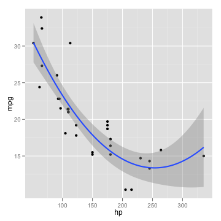
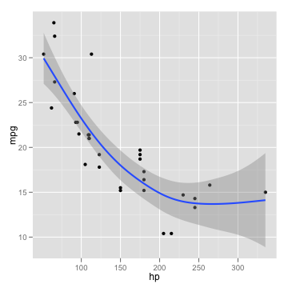
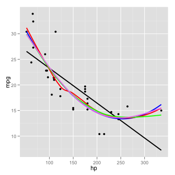
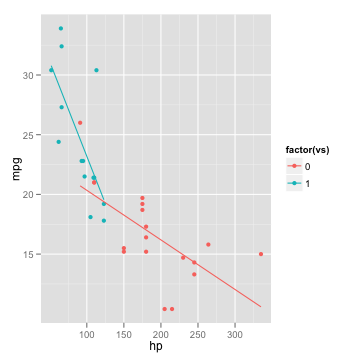
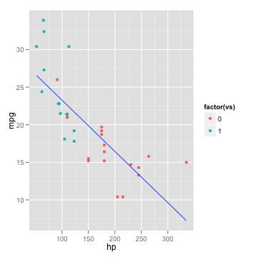

How can I explore different smooths in ggplot2?
~~~~~~~~~~~~~~~~~~~~~~~~~~~~~~~~~~~~~~~~~~~~~~~

Types of smooths
^^^^^^^^^^^^^^^^

Although points and lines of raw data can be helpful for exploring and
understanding data, it can be difficult to tell what the overall trend
or patterns are. Adding data summaries can make it much easier to see.
When working with two or more variables, rather than raw summaries such
as means, we can use conditional means or expected values of one
variable based on some model. To demonstrate this, we will use a data
set that is built into **R**, the '**mtcars**' data. Specifically, we
will look at the relationship between miles per gallon (**mpg**) and
horsepower (**hp**). in 32 different cars.

.. highlight:: r

::

    head(mtcars)

::

    ##                    mpg cyl disp  hp drat    wt  qsec vs am gear carb
    ## Mazda RX4         21.0   6  160 110 3.90 2.620 16.46  0  1    4    4
    ## Mazda RX4 Wag     21.0   6  160 110 3.90 2.875 17.02  0  1    4    4
    ## Datsun 710        22.8   4  108  93 3.85 2.320 18.61  1  1    4    1
    ## Hornet 4 Drive    21.4   6  258 110 3.08 3.215 19.44  1  0    3    1
    ## Hornet Sportabout 18.7   8  360 175 3.15 3.440 17.02  0  0    3    2
    ## Valiant           18.1   6  225 105 2.76 3.460 20.22  1  0    3    1

::

    require(ggplot2)
    require(methods)
    p <- ggplot(mtcars, aes(x = hp, y = mpg)) + geom_point()
    print(p)

.. figure:: figs/mtcars.png
   :align: center
   :alt: plot of chunk mtcars

   plot of chunk mtcars
One thing to notice is that into the '**p**' object, we saved both the
basic plot setup and the request to add points. This saves typing down
the road if we know we always want points plotted in our graph. A quick
visual of the data indicates the relationship may not be linear. This is
confirmed when we look at a linear smooth. The fit is poor at the
extremes.

::

    p + stat_smooth(method = "lm", formula = y ~ x, 
        size = 1)

.. figure:: figs/linear-fit.png
   :align: center
   :alt: plot of chunk linear-fit

   plot of chunk linear-fit
To get a sense of something like the mean miles per gallon at every
level of horsepower, we can instead use a locally weighted regression.

::

    p + stat_smooth(method = "loess", formula = y ~ 
        x, size = 1)

.. figure:: figs/local-wt-reg.png
   :align: center
   :alt: plot of chunk local-wt-reg

   plot of chunk local-wt-reg
Looking at the fit, it seems a quadratic function might be a good
approximation. We can go back to a linear model, but change the formula
to include a squared term for x (which is horse power here).

::

    p + stat_smooth(method = "lm", formula = y ~ x + 
        I(x^2), size = 1)

.. figure:: figs/quad-fun-approx.png
   :align: center
   :alt: plot of chunk quad-fun-approx

   plot of chunk quad-fun-approx
We could achieve the same results using orthogonal polynomials, in this
case with a second order (quadratic) polynomial. The advantage is that
the poly() function can easily fit polynomials of arbitrary degree

::

    p + stat_smooth(method = "lm", formula = y ~ poly(x, 
        2), size = 1)

   plot of chunk polynomial-fit
Another flexible aspect of the smooths is that it can use many different
modelling functions as long as they follow some common conventions. This
opens up access to many R packages to fit very specialized models. For
the sake of demonstration, we will try a generalized additive model
(GAM) from the '**mgcv**' package with a smooth on the x predictor
variable. First we load the required package, and then show how it is
easily used inside our graph.

::

    require(mgcv)
    p + stat_smooth(method = "gam", formula = y ~ 
        s(x), size = 1)

   plot of chunk gams
The GAM with a smooth seems to fit the data better than the straight
line did. We could also customize the basis dimension. Arbitrarily, we
choose 3.

::

    p + stat_smooth(method = "gam", formula = y ~ 
        s(x, k = 3), size = 1)

.. figure:: figs/custom-gam.png
   :align: center
   :alt: plot of chunk custom-gam

   plot of chunk custom-gam
If we wanted to directly compare, we could add multiple smooths and
colour them to see which we like best. By default each smooth would
include shaded standard errors, which would be messy so we turn them
off.

::

    p + stat_smooth(method = "lm", formula = y ~ x, 
        size = 1, se = FALSE, colour = "black") + stat_smooth(method = "lm", 
        formula = y ~ x + I(x^2), size = 1, se = FALSE, colour = "blue") + 
        stat_smooth(method = "loess", formula = y ~ x, size = 1, 
            se = FALSE, colour = "red") + stat_smooth(method = "gam", 
        formula = y ~ s(x), size = 1, se = FALSE, colour = "green") + 
        stat_smooth(method = "gam", formula = y ~ s(x, k = 3), 
            size = 1, se = FALSE, colour = "violet")

   plot of chunk multiple-smooths
It is clear in this case that all the models except the strictly linear
fit the data similarly. To distinguish which was "best" any further
would likely require comparing model fit statistics.

Smooths can also be fit separately by levels of another variable. This
allows a sort of examination of 'interactions' in the data.

::

    ggplot(mtcars, aes(x = hp, y = mpg, colour = factor(vs))) + 
        geom_point() + stat_smooth(method = "lm", formula = y ~ 
        x, se = FALSE)

   plot of chunk by-levels
::

    ggplot(mtcars, aes(x = hp, y = mpg, colour = factor(vs))) + 
        geom_point() + stat_smooth(aes(group = 1), method = "lm", 
        formula = y ~ x, se = FALSE)

.. figure:: figs/by-levels2.png
   :align: center
   :alt: plot of chunk by-levels

   plot of chunk by-levels
::

    ggplot(mtcars, aes(x = hp, y = mpg)) + geom_point(aes(colour = factor(vs))) + 
        stat_smooth(method = "lm", formula = y ~ x, se = FALSE)

   plot of chunk by-levels
Summary
^^^^^^^

Smoothed, conditional summaries are easy to add to plots in ggplot2.
This makes it easy to see overall trends and explore visually how
different models fit the data. Many of the examples were redundant or
clearly a poor choice for this particular data; the purpose was to
demonstrate the capabilities of ggplot2 and show what options are
available. Each example may be more or less appropriate for exploring a
particular set of data.
